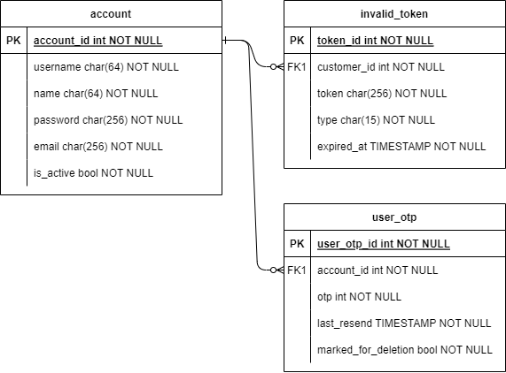

# Account

For account service database, there will be three table. The first one is account that hold user data. 

Next is invalid_token database that hold revoked token. The database will **probed regularly to revoked any token that are already expired**. 

Lastly, is user_otp table. It's for storing **user otp**. This database will also **regularry probed **to delete any otp that are **marked_for_deletion**. 
